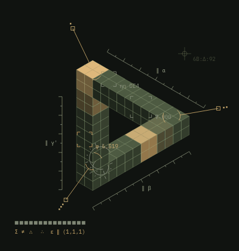
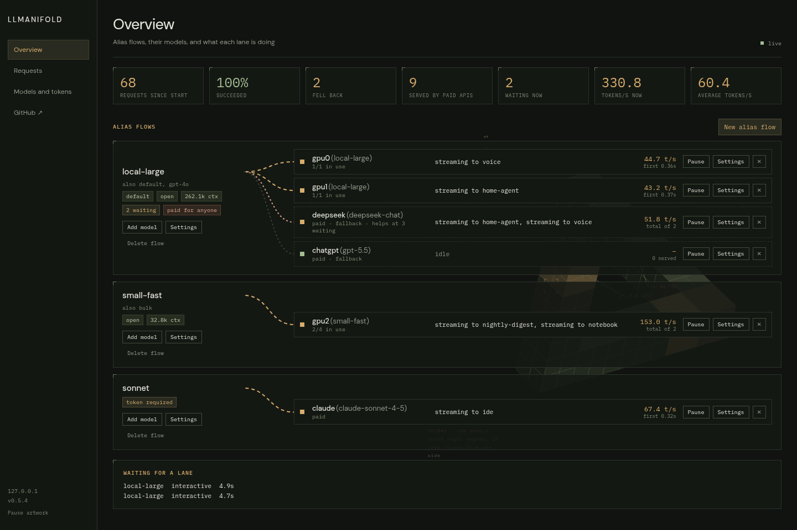
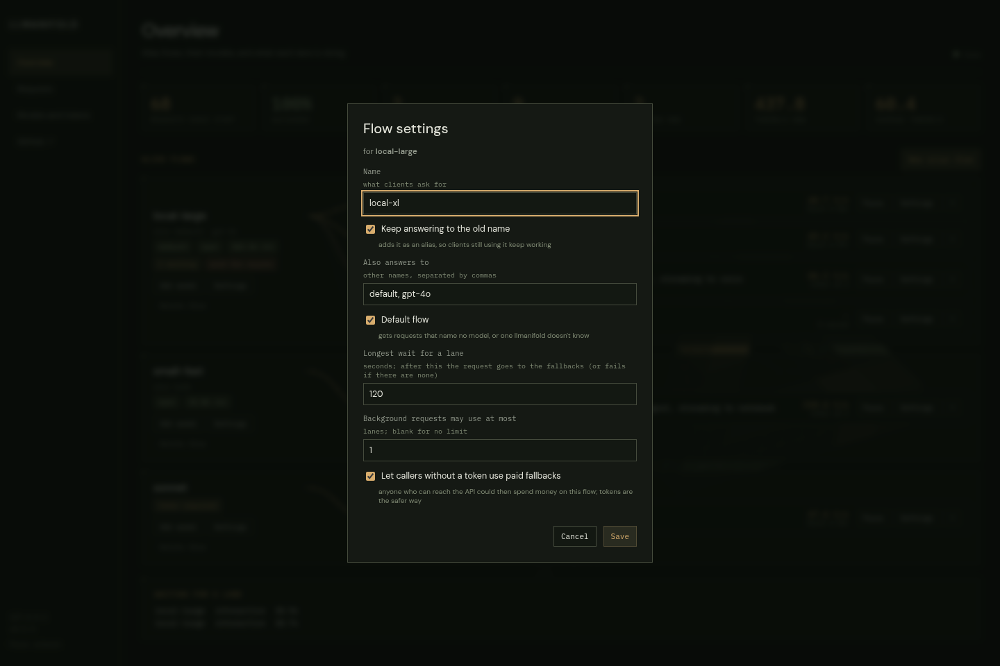
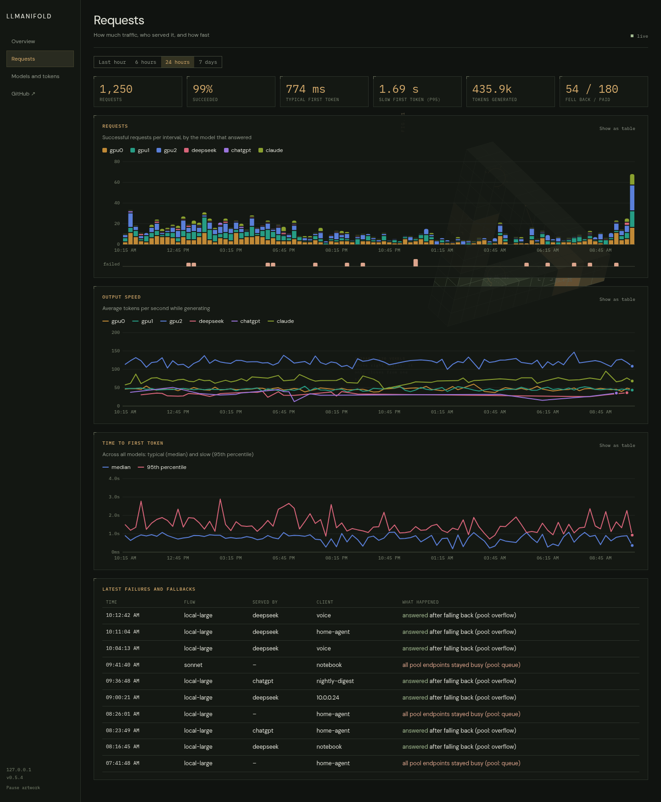
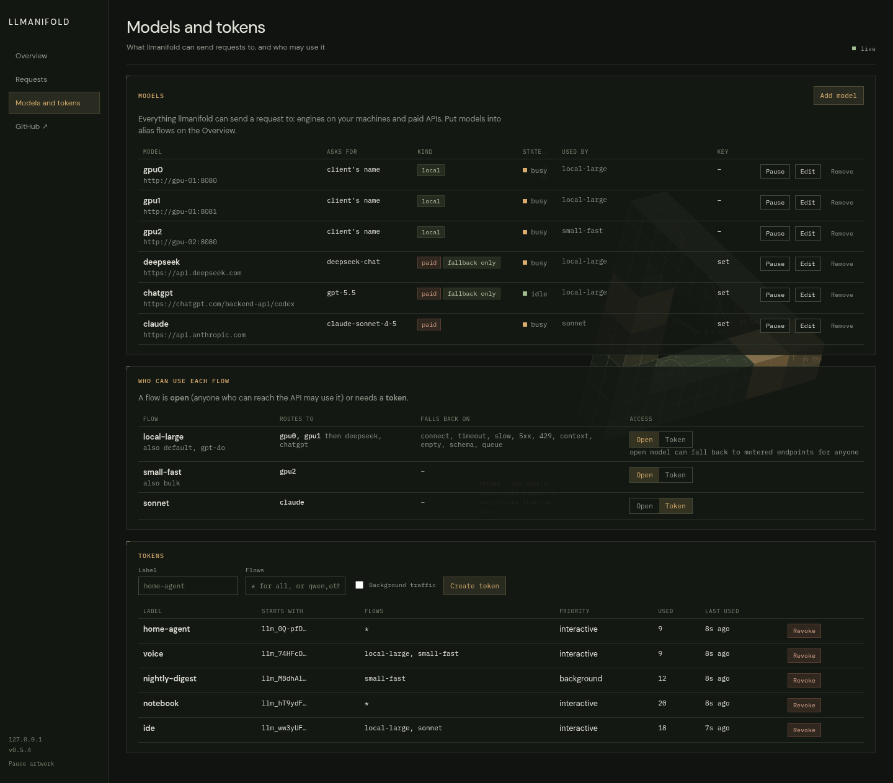
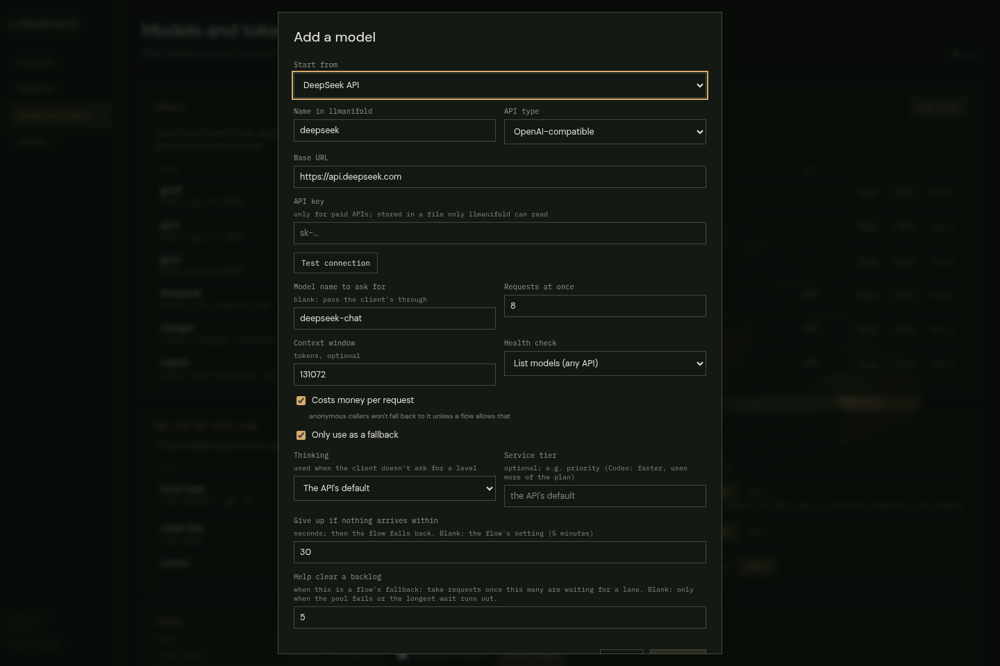
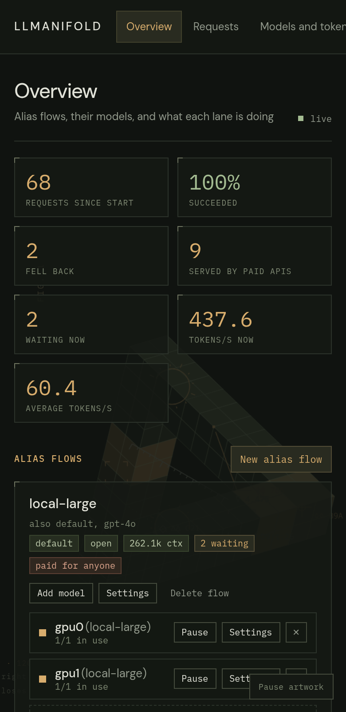

# llmanifold

**One front door for every LLM you run or rent: local engines and paid APIs behind one address, with queueing, fallbacks and a live dashboard.**

You run a few model servers (llama.cpp, vLLM, LM Studio, anything OpenAI-compatible) and maybe pay for an API or two. Each has its own address, its own limits, and no idea what the others are doing. llmanifold sits in front of all of them. Clients ask for a model name; llmanifold picks a free engine for it, makes the rest wait their turn, hands the request to a fallback when the first choice can't answer, and translates between the OpenAI and Anthropic API shapes on the way.

<p align="center">
  
</p>

- **One address for everything.** Point every client at one URL and one model name, whatever is serving it today.
- **Engines never trip over each other.** Identical engines pool into lanes; two requests never land on the same single-sequence engine.
- **A backlog clears itself.** When requests pile up or an engine fails, a paid API or a ChatGPT plan takes the overflow, by rules you set.
- **You can see it.** Every lane, the queue, speed and time to first token, live and over the last week.

llmanifold only routes. It doesn't start, stop or download models.

> **Status: early, single-maintainer software.** It fronts a real home GPU box every
> day, but options and the admin API still change between versions.

- [Quickstart](#quickstart): install, one config file, a first request
- [What it does](#what-it-does): pools, fallbacks, dialects, priorities, tokens
- [The dashboard](#the-dashboard): flows and lanes, charts, models and tokens
- [Configuration](#configuration) · [Command line](#command-line) · [API surface](#api-surface) · [Rook](#rook)

## Quickstart

**You need:** Python 3.11+ and at least one OpenAI- or Anthropic-compatible endpoint to point at.

### 1. Install

```sh
curl -fsSL https://raw.githubusercontent.com/Bake-Ware/llmanifold/main/install.sh | sh
```

The installer puts llmanifold in its own venv, writes a starter config and a
systemd unit, and starts it. Run as root it installs system-wide (`/opt/llmanifold`,
`/etc/llmanifold/config.yaml`); as anyone else it installs for that user
(`~/.local/share/llmanifold`, `~/.config/llmanifold/config.yaml`). Run it again to
upgrade: it keeps your config and data, and leaves restarting a running service to
you. `--ref <commit>` pins a version, `--no-service` skips systemd, `--uninstall`
removes it.

Or install only the package and run it yourself (steps 2 and 3):

```sh
pip install git+https://github.com/Bake-Ware/llmanifold
```

### 2. Describe your endpoints

Copy [`config.example.yaml`](config.example.yaml) from this repo to `config.yaml`
and edit the endpoints and models. The smallest useful file is two engines pooled
behind one name:

```yaml
endpoints:
  gpu0: {url: http://127.0.0.1:8080, max_concurrency: 1, probe: llamacpp}
  gpu1: {url: http://127.0.0.1:8081, max_concurrency: 1, probe: llamacpp}

models:
  local-large:
    aliases: [default]
    pool: [gpu0, gpu1]
```

### 3. Start it

```sh
llmanifold check -c config.yaml
llmanifold serve -c config.yaml
```

The API listens on `:1234` and the dashboard on `http://127.0.0.1:1240`.
A systemd unit is in [`deploy/llmanifold.service`](deploy/llmanifold.service).

### 4. Make a first request

```sh
curl http://127.0.0.1:1234/v1/chat/completions \
  -H 'Content-Type: application/json' \
  -d '{"model": "local-large", "messages": [{"role": "user", "content": "Say hi."}]}'
```

Point OpenAI clients at `http://<host>:1234/v1`. Anthropic SDKs use
`http://<host>:1234` (they call `/v1/messages`). Either kind of client can reach
either kind of upstream.

## What it does

- **Pools.** Put several endpoints behind one model name. Requests go to the
  least-loaded one, and a conversation sticks to the endpoint that served it
  last (warm prompt cache). Choosing and reserving a lane happen atomically, so
  two requests arriving together never land on the same single-sequence engine.
- **Fallbacks as rules.** Each model lists fallback endpoints and the failures
  that trigger them: `connect`, `timeout`, `slow`, `5xx`, `429`, `4xx`,
  `context`, `empty`, `schema`, `queue`. Fallback only happens before any content reaches
  the client; streams are held until the first token so a failed start can be
  retried elsewhere. A fallback can also help with load: `overflow_at: 5` sends
  requests to it once five are waiting for a lane, so the queue never grows
  past four while it has room. A remote API that accepts requests but sends
  nothing before its `first_token_timeout` is skipped for a minute, then gets one
  request at a time until one is answered; requests it held go back to wait for
  the pool instead of failing.
- **Metered endpoints.** Mark paid APIs `metered: true`. Open models don't fall
  back to them for anonymous callers unless you allow it, and a webhook fires
  whenever one serves a request (so a bot can tell you).
- **Structured output where the API lacks it.** DeepSeek accepts JSON mode but
  not `response_format: json_schema`. For such endpoints (`json_schema: emulate`,
  the default for DeepSeek URLs) llmanifold sends the schema in the prompt, checks
  the reply against it, and sends a reply that doesn't fit back to the model with
  what was wrong. After three tries the request moves on to the next fallback
  (trigger `schema`). The client only ever sees a reply that fits, so a streaming
  client gets it in one piece.
- **Dialects.** `/v1/chat/completions` and `/v1/messages` both work against
  either kind of upstream, streaming included: messages, system prompts, tools
  and tool results, images, stop sequences, usage.
- **ChatGPT plans via Codex.** An endpoint with `dialect: responses` speaks
  OpenAI's Responses API; add `login: chatgpt` and point it at
  `https://chatgpt.com/backend-api/codex` to serve requests from a ChatGPT
  plan, the way the Codex CLI does. Sign in from the admin site with a device
  code (or paste a Codex `auth.json`); tokens refresh by themselves and are
  stored in `<data_dir>/chatgpt/` (mode 600).
- **Priorities.** Requests marked background (by token, or the
  `X-LLManifold-Priority: background` header) queue behind interactive ones and
  can be limited to N lanes per model.
- **Tokens per model.** A model is `open` or needs a token. Tokens are created,
  scoped and revoked in the admin site.
- **Per-endpoint request defaults.** `reasoning_effort` sets an endpoint's
  thinking level when the client doesn't name one (`none` through `max`), and
  `service_tier` is passed upstream (e.g. `priority` on the Codex backend).
- **Dashboard.** Live alias flows and lanes, charts of traffic, speed and
  time to first token (SQLite history, 30 days by default), and token
  management, on a separate admin listener. From the admin site you can add,
  edit, pause and remove models (including paid APIs, with a connection test)
  and build alias flows: rename them, give them aliases, pick the default.
  Changes are written back to the YAML file with comments kept, and API keys
  go to files only llmanifold can read. Prometheus metrics at `/metrics`.
- **Proxy-friendly.** Keepalives (SSE comments, or leading whitespace on JSON)
  stop proxies like Cloudflare from cutting long generations at ~100 s.

## The dashboard

The admin listener serves a dashboard that shows what llmanifold is doing and
lets you change it. It is separate from the API listener, so you can keep it
private (see [Admin access](#admin-access)).

**Overview** draws each alias flow as a manifold: the name clients ask for on the
left, a pipe to every lane that can serve it on the right. Each lane is labelled
with the engine and the model name it is asked for, as in `gpu0 (local-large)`;
an engine with no `model` set is sent the name the client used. Busy pipes run
amber, fallbacks are dashed, and anything waiting for a lane is listed
underneath. Pause a model from here and it finishes what it has and takes
nothing new.

A flow's **Settings** rename it, change the other names it answers to, and make
it the default flow (the one that gets requests naming no model, or a model
llmanifold doesn't know). A rename moves everything with the flow: its place in
the config, its open/token setting and the tokens scoped to it. The old name
can stay on as an alias, so clients still using it keep working.

<p align="center">
  
</p>

**Requests** charts traffic by the model that answered, output speed, and time to
first token (typical and 95th percentile) over the last hour, six hours, day or
week, with the latest failures and fallbacks listed below.

<p align="center">
  
</p>

**Models and tokens** lists everything a request can be sent to, which flows are
open and which need a token, and the tokens themselves. Tokens are created,
scoped and revoked here.

<p align="center">
  
</p>

Adding a paid API is a form with presets and a connection test. The key you type
is written to a file only llmanifold can read, never to the config file.

<p align="center">
  
</p>



It works on a phone too. The artwork behind the page is the mark at the top of
this file: an impossible triangle built from voxels that bursts apart and
reassembles, with amber bands that multiply as requests come in. It can be paused
from the sidebar and stays still for anyone who asks their system for reduced
motion.

The images in this file are generated from the real dashboard and made-up data by
[`docs/screenshots/make_screenshots.py`](docs/screenshots/make_screenshots.py).

<br clear="right">

## Configuration

Everything lives in one YAML file; see
[`config.example.yaml`](config.example.yaml) for every option with comments.
The file is watched and reloaded on change (or `llmanifold ctl reload`); a
broken edit is rejected and the running config stays in place, with the
error shown in the dashboard.

Changes made in the admin site are written to the same file: comments, order
and list style are kept, the previous version is saved next to it as
`config.yaml.bak-<time>` (the last 20 are kept), and keys typed into the site
are stored in `<data_dir>/keys/` (mode 600) and referenced with `key_file`.
The admin site calls endpoints **models** and config models **alias flows**.
Pausing a model (from the site, `ctl drain`, or Rook) survives restarts.

```yaml
endpoints:
  gpu0: {url: http://127.0.0.1:8080, max_concurrency: 1, context: 262144, probe: llamacpp}
  gpu1: {url: http://127.0.0.1:8081, max_concurrency: 1, context: 262144, probe: llamacpp}
  deepseek:
    url: https://api.deepseek.com
    model: deepseek-chat
    key_env: DEEPSEEK_API_KEY
    metered: true
    fallback: true

models:
  local-large:
    aliases: [default]
    pool: [gpu0, gpu1]
    fallback: [deepseek]
    background_max_lanes: 1
```

API keys come from `key_env` or `key_file`; avoid literal `key:` values.

Set `default_model` to route requests that name no model, or one llmanifold
doesn't know, instead of answering 404 (handy when replacing a single-model
server whose clients send whatever name they were configured with). The
"Default flow" checkbox in a flow's Settings sets it from the dashboard.

### Probes

`probe` decides how health and busy state are checked between requests:
`models` (GET `/v1/models`), `llamacpp` (`/slots`), `strata` (`/status`), or
`none`. Engines that report busy state let llmanifold route around work it
didn't send itself.

### Admin access

The admin listener only accepts addresses in `admin.allow_from` (loopback by
default), and anyone it accepts has full control: editing models and flows,
tokens and sign-ins. llmanifold does no login of its own, so to reach the
dashboard from elsewhere, widen `allow_from` to a network you trust or put
your own authenticating proxy in front. Keep the API and the admin site on
separate hostnames if the proxy's login would get in the way of API clients.

## Command line

```sh
llmanifold serve -c config.yaml
llmanifold check -c config.yaml
llmanifold ctl status | endpoints | models | queue | requests [N]
llmanifold ctl drain gpu1      # stop new requests to an endpoint; in-flight ones finish
llmanifold ctl undrain gpu1
llmanifold ctl reload
```

`ctl` talks to the admin API (`--admin`, or `LLMANIFOLD_ADMIN`).

## API surface

| Path | |
|---|---|
| `POST /v1/chat/completions` | OpenAI chat, streaming or not |
| `POST /v1/messages` | Anthropic messages, streaming or not |
| `POST /v1/messages/count_tokens` | estimate |
| `GET /v1/models` | models and aliases, with context length |
| `GET /healthz`, `/slots`, `/props` | health and lane state, llama.cpp-style |
| `POST /v1/*` (other) | passed through to the model's first pool endpoint |

Clients authenticate to `token` models with `Authorization: Bearer llm_…` or
`x-api-key: llm_…`.

## Rook

llmanifold ships a [Rook](https://github.com/Bake-Ware/rook) worker plugin
(`llmanifold_rook`, entry point `rook.plugins`). On a worker with the plugin
API (core API 1.1+) and llmanifold installed in the same environment, the
worker gains `llmanifold.status`, `.endpoints`, `.queue`, `.requests`,
`.drain`, `.undrain` and `.reload`. The plugin loads only where an admin
listener answers (`admin_url` setting, or `LLMANIFOLD_ADMIN`).

Older workers without the plugin API can use custom caps instead:

```sh
llmanifold rook-caps --format calls   # one customcap.add call per line
```

## Development

```sh
pip install -e '.[dev]'
pytest
```

## License

MIT
