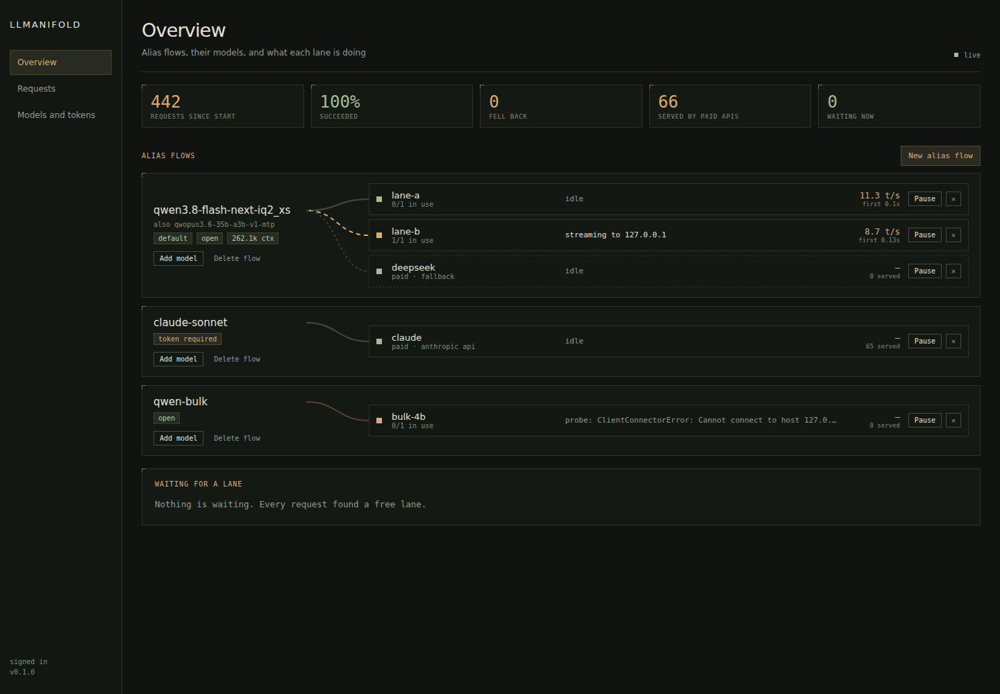
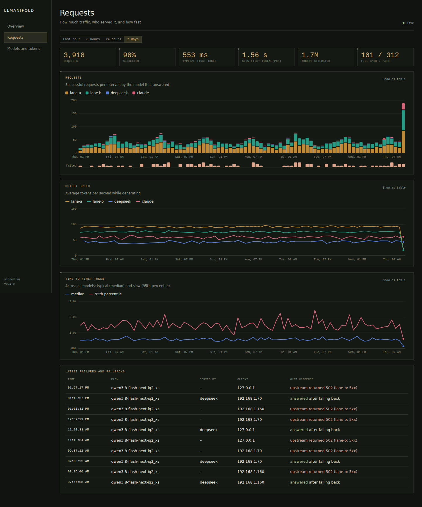

# llmanifold

One front door for many LLM endpoints.

llmanifold is a small async router that sits in front of local engines
(llama.cpp, vLLM, LM Studio, anything OpenAI-compatible) and remote APIs. Clients
ask for a model name; llmanifold picks a free endpoint for it, falls back to
another when that one can't answer, and translates between the OpenAI and
Anthropic API shapes on the way.





- **Pools.** Put several endpoints behind one model name. Requests go to the
  least-loaded one, and a conversation sticks to the endpoint that served it
  last (warm prompt cache). Choosing and reserving a lane happen atomically, so
  two requests arriving together never land on the same single-sequence engine.
- **Fallbacks as rules.** Each model lists fallback endpoints and the failures
  that trigger them: `connect`, `timeout`, `slow`, `5xx`, `429`, `4xx`,
  `context`, `empty`, `queue`. Fallback only happens before any content reaches
  the client; streams are held until the first token so a failed start can be
  retried elsewhere. A fallback can also help with load: `overflow_at: 5` sends
  requests to it once five are waiting for a lane, so the queue never grows
  past four while it has room.
- **Metered endpoints.** Mark paid APIs `metered: true`. Open models don't fall
  back to them for anonymous callers unless you allow it, and a webhook fires
  whenever one serves a request (so a bot can tell you).
- **Dialects.** `/v1/chat/completions` and `/v1/messages` both work against
  either kind of upstream, streaming included: messages, system prompts, tools
  and tool results, images, stop sequences, usage.
- **ChatGPT plans via Codex.** An endpoint with `dialect: responses` speaks
  OpenAI's Responses API; add `login: chatgpt` and point it at
  `https://chatgpt.com/backend-api/codex` to serve requests from a ChatGPT
  plan, the way the Codex CLI does. Sign in from the admin site with a device
  code (or paste a Codex `auth.json`); tokens refresh by themselves and are
  stored in `<data_dir>/chatgpt/` (mode 600).
- **Priorities.** Requests marked background (by token, or the
  `X-LLManifold-Priority: background` header) queue behind interactive ones and
  can be limited to N lanes per model.
- **Tokens per model.** A model is `open` or needs a token. Tokens are created,
  scoped and revoked by a person in the admin site; agents can read status and
  drain endpoints, but can't mint tokens or change who needs one.
- **Dashboard.** Live alias flows and lanes, charts of traffic, speed and
  time to first token (SQLite history, 30 days by default), and token
  management, on a separate admin listener. People signed in through the admin
  site can add, edit, pause and remove models (including paid APIs, with a
  connection test) and build alias flows; changes are written back to the YAML
  file with comments kept, and API keys go to files only llmanifold can read.
  Prometheus metrics at `/metrics`.
- **Proxy-friendly.** Keepalives (SSE comments, or leading whitespace on JSON)
  stop proxies like Cloudflare from cutting long generations at ~100 s.

llmanifold only routes. It doesn't start, stop or download models.

## Install

Python 3.11+.

```sh
pip install git+https://github.com/Bake-Ware/llmanifold
cp config.example.yaml config.yaml   # from this repo; edit endpoints and models
llmanifold check -c config.yaml
llmanifold serve -c config.yaml
```

Point clients at `http://<host>:1234/v1` (OpenAI) or `http://<host>:1234`
(Anthropic SDKs use `/v1/messages`). The dashboard is on
`http://127.0.0.1:1240`.

A systemd unit is in [`deploy/llmanifold.service`](deploy/llmanifold.service).

## Configuration

Everything lives in one YAML file; see
[`config.example.yaml`](config.example.yaml) for every option with comments.
The file is watched and reloaded on change (or `llmanifold ctl reload`); a
broken edit is rejected and the running config stays in place, with the
error shown in the dashboard.

Changes made in the admin site are written to the same file: comments, order
and list style are kept, the previous version is saved next to it as
`config.yaml.bak-<time>` (the last 20 are kept), and keys typed into the site
are stored in `<data_dir>/keys/` (mode 600) and referenced with `key_file`.
The admin site calls endpoints **models** and config models **alias flows**.
Pausing a model (from the site, `ctl drain`, or Rook) survives restarts.

```yaml
endpoints:
  gpu0: {url: http://127.0.0.1:8080, max_concurrency: 1, context: 262144, probe: llamacpp}
  gpu1: {url: http://127.0.0.1:8081, max_concurrency: 1, context: 262144, probe: llamacpp}
  deepseek:
    url: https://api.deepseek.com
    model: deepseek-chat
    key_env: DEEPSEEK_API_KEY
    metered: true
    fallback: true

models:
  local-large:
    aliases: [default]
    pool: [gpu0, gpu1]
    fallback: [deepseek]
    background_max_lanes: 1
```

API keys come from `key_env` or `key_file`; avoid literal `key:` values.

Set `default_model` to route requests that name no model, or one llmanifold
doesn't know, instead of answering 404 (handy when replacing a single-model
server whose clients send whatever name they were configured with).

### Probes

`probe` decides how health and busy state are checked between requests:
`models` (GET `/v1/models`), `llamacpp` (`/slots`), `strata` (`/status`), or
`none`. Engines that report busy state let llmanifold route around work it
didn't send itself.

### Admin access

The admin listener only accepts addresses in `admin.allow_from` (loopback by
default). To publish it, put an authenticating proxy in front and list the
proxy in `admin.trusted_proxies`: requests from it must carry the signed-in
user's email (`Cf-Access-Authenticated-User-Email` by default) and those users
count as people, who can manage tokens. Keep the API and the admin site on
separate hostnames if the proxy's login would get in the way of API clients.

## Command line

```sh
llmanifold serve -c config.yaml
llmanifold check -c config.yaml
llmanifold ctl status | endpoints | models | queue | requests [N]
llmanifold ctl drain gpu1      # stop new requests to an endpoint; in-flight ones finish
llmanifold ctl undrain gpu1
llmanifold ctl reload
```

`ctl` talks to the admin API (`--admin`, or `LLMANIFOLD_ADMIN`).

## API surface

| Path | |
|---|---|
| `POST /v1/chat/completions` | OpenAI chat, streaming or not |
| `POST /v1/messages` | Anthropic messages, streaming or not |
| `POST /v1/messages/count_tokens` | estimate |
| `GET /v1/models` | models and aliases, with context length |
| `GET /healthz`, `/slots`, `/props` | health and lane state, llama.cpp-style |
| `POST /v1/*` (other) | passed through to the model's first pool endpoint |

Clients authenticate to `token` models with `Authorization: Bearer llm_…` or
`x-api-key: llm_…`.

## Rook

llmanifold ships a [Rook](https://github.com/Bake-Ware/rook) worker plugin
(`llmanifold_rook`, entry point `rook.plugins`). On a worker with the plugin
API (core API 1.1+) and llmanifold installed in the same environment, the
worker gains `llmanifold.status`, `.endpoints`, `.queue`, `.requests`,
`.drain`, `.undrain` and `.reload`. The plugin loads only where an admin
listener answers (`admin_url` setting, or `LLMANIFOLD_ADMIN`).

Older workers without the plugin API can use custom caps instead:

```sh
llmanifold rook-caps --format calls   # one customcap.add call per line
```

## Development

```sh
pip install -e '.[dev]'
pytest
```

## License

MIT
